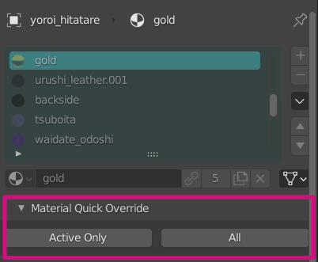

Material Quick Override
====

This add-on adds "Quick Override" buttons that localizes the material added by Library Override.

Requirements
----

* Blender >= 3.0

Installation
----

1. Download ZIP package.
2. In Blender, install via **"Edit > Preferences... > Add-ons > Install..."**

Usage
----

"Material Quick Override" panel appears on Material Properties.

- **Active Only**: Make the selected material local.
- **All**: Make all materials in list local.
